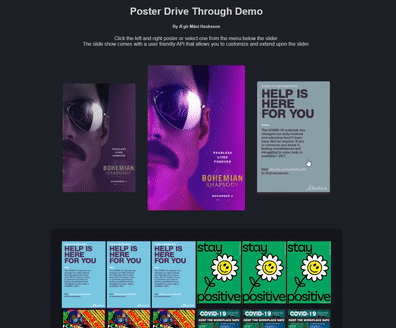
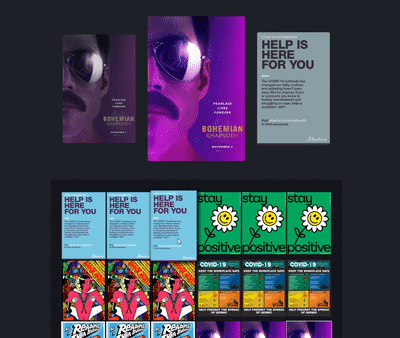
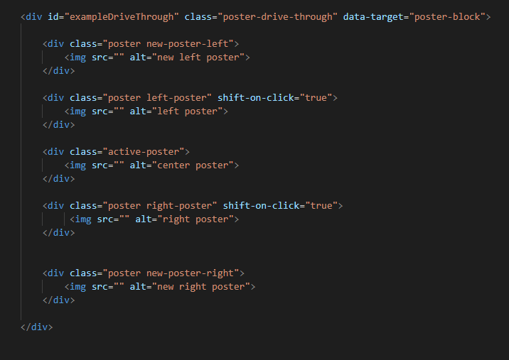

# Drive Through Image Slider
Simple animated image slideshow plugin for HTML. 

1. Allows binding events to shift the slider in either direction \

2. Allows easy customization with animation speeds \

3. Easy to set up \



### JSFiddle demo
https://jsfiddle.net/agirmani/qh9j4kt7/18/

### CDN'S
1. Stylesheet\
`<link rel="stylesheet" type="text/css" href="https://cdn.jsdelivr.net/gh/hauks96/drive-through-image-slider/posterDriveThrough/drive_through.css">`
2. Script\
`<script src="https://cdn.jsdelivr.net/gh/hauks96/drive-through-image-slider/posterDriveThrough/drive_through.js"></script>`

### Dependencies
1. JQuery slim-min or greater\
Make sure it is loaded before the image slider script cdn. See the JsFiddle example for reference.


### Setup
#### 1. The html
Copy paste this html to set up a slider. Don't forget to include the cdn's listed above.
```
<div class="poster-drive-through" data-target="some-class" start-index="random" fixed-max-height="true" animate-on-load="true">
    <div class="poster new-poster-left">
        
    </div>

    <div class="poster left-poster">
        
    </div>

    <div class="active-poster">
        
    </div>

    <div class="poster right-poster" shift-on-click="true">
         
    </div>

    <div class="poster new-poster-right">
        
    </div>
</div>
```
In addition to this you **must** have elements in your dom with class `some-class` related to the drive throughs `data-target` attribute that contain your images. **One** of the direct descendants of these elements must be an `` tag for the slider to fetch images on demand.\
Example:
```
<div class="some-class">
    <div id="Some random stuff">...</div>
    
</div>
<div class="come-class">
    
    <div id="Some random stuff">...</div>
</div>
...
```
#### 2. Custom settings
a) **animate-on-load** \
  If you don't want the drive through to animate on page load you can set the animate-on-load to false.\
  `<div class="poster-drive-through" data-target="some-class" animate-on-load="false">...`
  
b) **start-index** \
  Set the index (number) of the image you want to animate when the drive through loads. By default this will be set to zero. You can also set it to 'random' if you want to load   images on   a random index on each page reload. The index is related to how the elements are placed in the dom. The index of the desired element is the same as the index of it   in the result of getElementsByClassName(some-class).\
  `<div class="poster-drive-through" data-target="some-class" start-index="random">...`
  
c) **fixed-max-height** \
  This setting is to make sure the drive through doesn't have different heights when it scrolls through your images. This happens if your images aren't all the same height. To     tackle this you can fix the height of the slider to be the maximum height it would achieve with the largest image in the active center position.\
  `<div class="poster-drive-through" data-target="some-class" fixed-max-height="true">...`
  
d) **shift-on-click**\
  On the left and right posters (elements with classes `left-poster` & `right-poster`) you have the option to make them shift if they are pressed.
  ```
  ...
    <div class="poster left-poster" shift-on-click="true">
        
    </div>
    ...
    <div class="poster right-poster" shift-on-click="true">
         
    </div>
```

_If any of these custom attributes are missing from the slider, you will be notified in the console, so make sure to check the console on your first setup._

### General usage
Once you have initialized the html file according to the standards above you can now customize your slider even further in javascript.

#### Calling the slider class
The slider has an api which is available through your poster-drive-through elements. This connection is created by an onload method in the dom where the elements are bound to an instance of the image slider class. Let's assume you have the following slider set up.

```
<div id="sliderExample" class="poster-drive-through" data-target="some-class" animate-on-load="true" fixed-max-height="true" start-index="random">
    ... 
</div>
```
You can now use all methods and retrieve all variables available within the api by calling through `slider.DriveThrough.method_or_var`:
```
<script>
    // Examples
    let slider = document.getElementById('sliderExample');
    slider.DriveThrough.shiftLeft(); // Shifts slider left
    slider.DriveThrough.shiftRight(); // Shifts slider right (does not wait until last slide is finished)
    slider.DriveThrough.shiftToIndex('left', 15); // Shift slider to a given index via a given direction
    slider.DriveThrough.setAnimationTime = 0.4s; // Change the animation time for a shift
    slider.DriveThrough.resetAnimationTime(); // Reset animation time to default
    ...
</script>
```
### API Overview
General calling convention: `posterDriveThrough_Element.DriveThrough.method_or_var`\
For more in depth details look at the source code documentation.

| Type | Name | Input | Output | Description |
|----|----|----|----|----|
| method | `shiftLeft` | none | none | Perform a left shift on the drive through. All images are shifted one to the left. This means that a new image will enter from the right side |
| method | `shiftRight` | none | none | Perform a right shift on the drive through. All images are shifted one to the right. This means that a new image will enter from the left side. |
| method | `shiftToIndex` | `direction:str` `index:int` | none | Shift the drive through to a specific index (according to center poster). The direction says in which direction to animate the change. |
| method | `setFixedMaxHeight` | none | none | Sets drive through height according to the tallest image available. |
| method | `setAnimationTime` | `seconds:float` | none | Change the time it takes to animate a shift in either direction. All delays are automatically adjusted to scale correctly. |
| method | `resetAnimationTime` | none | none |  reset the animation time to default. The times from the variable defaultAnimationTimings will be used. |
| method | `getImages` | none | `[str, str, str]` | Get images from data target according to the data-index attribute of the left, center and right poster returned as a list in that order. |
| method | `updateImages` | none | none | Updates the images in the drive through according to the current data-indexes of the posters. |
| method | `loadImagesByIndex` | `index:int or str:'random'` | none |  Load images from a given index into the drive through. |
| method | `setNewCenterIndex` | none | none | Set the data-index values of all posters according to a new index of the center poster. Can take either an int or 'random'. Does not update images. |
| method | `shiftPosterIndexes` | none | none | Shift the indexes in the drive through in either direction by one. If an end is met on either side, it will continue on the other side. Does not update images. |
| getter | `choices` | none | `[dom elements]` | Returns the dom elements associated with the drive through data-target. Utilizes the getElementsByClassName method. |
| getter | `leftPoster`/ `rightPoster`/ `centerPoster` | none | `dom element` | Returns the poster dom element. |
| getter/setter | `leftIndex`/ `rightIndex`/ `centerIndex` | `int` | `int` | The index of the posters. |
| getter/setter | `leftIndex`/ `rightIndex`/ `centerIndex` | `int` | `int` | The index of the posters. |
| getter | `leftPosterImageElement`/ `rightPosterImageElement`/ `centerPosterImageElement` | none | `dom element` | Returns the poster's image element (``). |
| getter/setter | `leftPosterImageSrc`/ `rightPosterImageSrc`/ `centerPosterImageSrc` | `ulr:str` | `url:str` | The poster's image source. |
| getter/setter | `height` | `px: int` | `px: int` | The height of the drive through. |
| getter | `maxActiveHeight` | none | `px: int` | The maximum height the drive through can achieve with the available images. |
| getter/setter | `startIndex` | `index: int` | `index: int` | The start index of the drive through. Valid options are integers or 'random' |
| var | `defaultAnimationTimings` | none | none | An object containing all timings. See source code for details. |
| var | Animation Classes | none | none | See the variables in source code if you want to apply your own animation classes to the drive through |
